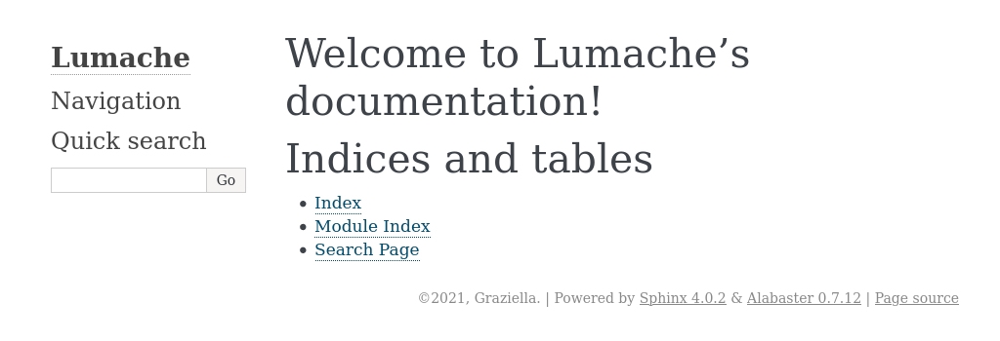

011 Getting started
===================

源教程地址: https://www.sphinx-doc.org/en/master/tutorial/getting-started.html .

Setting up your project and development environment
---------------------------------------------------

In a new directory, create a file called ``README.rst`` with the following content.

**README.rst**

::

 Lumache
 =======

 **Lumache** (/lu'make/) is a Python library for cooks and food lovers that
 creates recipes mixing random ingredients.

It is a good moment to create a Python virtual environment and install the required tools. 
For that, open a command line terminal, 
cd into the directory you just created, and run the following commands:

.. prompt:: bash $,(.venv)...$ auto

   $ python -m venv .venv
   $ source .venv/bin/activate
   (.venv)...$ python -m pip install sphinx

**Note**

The installation method used above is described in more detail in Installation from PyPI. 
For the rest of this tutorial, the instructions will assume a Python virtual environment.

If you executed these instructions correctly, 
you should have the Sphinx command line tools available. 
You can do a basic verification running this command:

.. prompt:: bash $,(.venv)...$ auto

   (.venv)...$ sphinx-build --version
   sphinx-build 4.0.2

If you see a similar output, you are on the right path!

Creating the documentation layout
---------------------------------

Then from the command line, run the following command:

.. prompt:: bash $,(.venv)...$ auto

   (.venv)...$ sphinx-quickstart docs

This will present to you a series of questions required to create the basic directory 
and configuration layout for your project inside the docs folder. 
To proceed, answer each question as follows:

- > Separate source and build directories (y/n) [n]: Write “y” (without quotes) and press Enter.

- > Project name: Write “Lumache” (without quotes) and press Enter.

- > Author name(s): Write “Graziella” (without quotes) and press Enter.

- > Project release []: Write “0.1” (without quotes) and press Enter.

- > Project language [en]: Leave it empty (the default, English) and press Enter.

After the last question, you will see the new docs directory with the following content.

::

 docs
 ├── build
 ├── make.bat
 ├── Makefile
 └── source
    ├── conf.py
    ├── index.rst
    ├── _static
    └── _templates

The purpose of each of these files is:

build/

 An empty directory (for now) that will hold the rendered documentation.

make.bat and Makefile

 Convenience scripts to simplify some common Sphinx operations, such as rendering the content.

source/conf.py

 A Python script holding the configuration of the Sphinx project. 
 It contains the project name and release you specified to sphinx-quickstart, 
 as well as some extra configuration keys.

source/index.rst

 The root document of the project, 
 which serves as welcome page and contains the root of the “table of contents tree” (or toctree).

Thanks to this bootstrapping step, 
you already have everything needed to render the documentation as HTML for the first time. 
To do that, run this command:

.. prompt:: bash $,(.venv)...$ auto

   (.venv)...$ sphinx-build -b html docs/source/ docs/build/html

And finally, open docs/build/html/index.html in your browser. You should see something like this:

   
   Freshly created documentation of Lumache

There we go! You created your first HTML documentation using Sphinx. 
Now you can start customizing it.