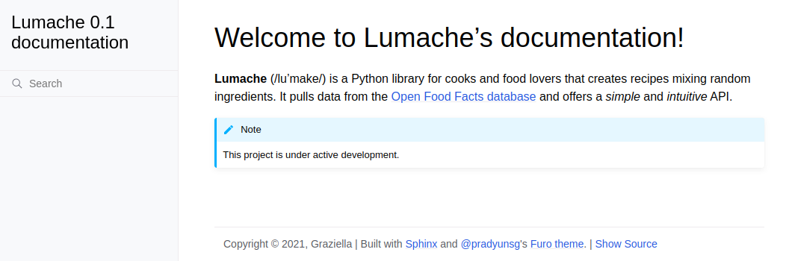

013 More Sphinx customization
=============================

源教程地址: https://www.sphinx-doc.org/en/master/tutorial/more-sphinx-customization.html .

There are two main ways to customize your documentation beyond what is possible with core Sphinx: 
extensions and themes.

Enabling a built-in extension
-----------------------------

In addition to these configuration values, 
you can customize Sphinx even more by using `extensions <https://www.sphinx-doc.org/en/master/usage/extensions/index.html>`_. 
Sphinx ships several builtin ones, and there are many more maintained by the community.

For example, to enable the sphinx.ext.duration extension, 
locate the extensions list in your conf.py and add one element as follows:

**docs/source/conf.py**

::

 # Add any Sphinx extension module names here, as strings. They can be
 # extensions coming with Sphinx (named 'sphinx.ext.*') or your custom
 # ones.
 extensions = [
     'sphinx.ext.duration',
 ]

After that, every time you generate your documentation, 
you will see a short durations report at the end of the console output, like this one:

.. prompt:: bash $,(.venv)...$ auto

   (.venv)...$ make html
   ...
   The HTML pages are in build/html.
   
   ====================== slowest reading durations =======================
   0.042 temp/source/index

Using a third-party HTML theme
------------------------------

Themes, on the other hand, are a way to customize the appearance of your documentation. 
Sphinx has several `builtin themes <https://www.sphinx-doc.org/en/master/usage/theming.html#builtin-themes>`_, 
and there are also `third-party ones <https://sphinx-themes.org/>`_.

For example, to use the Furo third-party theme in your HTML documentation, 
first you will need to install it with pip in your Python virtual environment, like this:

.. prompt:: bash $,(.venv)...$ auto

   (.venv)...$ pip install furo

And then, locate the html_theme variable on your conf.py and replace its value as follows:

**docs/source/conf.py**

::

 # The theme to use for HTML and HTML Help pages.  See the documentation for
 # a list of builtin themes.
 #
 html_theme = 'furo'

With this change, you will notice that your HTML documentation has now a new appearance:

   
   HTML documentation of Lumache with the Furo theme

It is now time to expand the narrative documentation and split it into several documents.