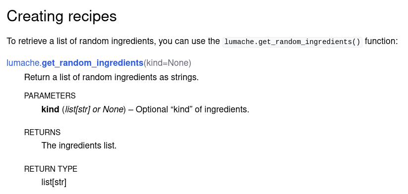

015 Describing code in Sphinx
=============================

源教程地址: https://www.sphinx-doc.org/en/master/tutorial/describing-code.html .

In the previous sections of the tutorial 
you can read how to write narrative or prose documentation in Sphinx. 
In this section you will describe code objects instead.

Sphinx supports documenting code objects in several languages, 
namely **Python**, **C**, **C++**, **JavaScript**, and **reStructuredText**. 
Each of them can be documented using a series of directives and roles grouped by domain. 
For the remainder of the tutorial you will use the Python domain, 
but all the concepts seen in this section apply for the other domains as well.

Python
------

**Documenting Python objects**

Sphinx offers several roles and directives to document Python objects, 
all grouped together in the Python domain. 
For example, you can use the ``py:function`` directive to document a Python function, 
as follows:

``docs/source/usage.rst``

::

 Creating recipes
 ----------------
 
 To retrieve a list of random ingredients,
 you can use the ``lumache.get_random_ingredients()`` function:
 
 .. py:function:: lumache.get_random_ingredients(kind=None)
 
    Return a list of random ingredients as strings.
 
    :param kind: Optional "kind" of ingredients.
    :type kind: list[str] or None
    :return: The ingredients list.
    :rtype: list[str]

Which will render like this:

   
   The rendered result of documenting a Python function in Sphinx

To retrieve a list of random ingredients,
you can use the ``lumache.get_random_ingredients()`` function:

.. py:function:: lumache.get_random_ingredients(kind=None)

   Return a list of random ingredients as strings.

   :param kind: Optional "kind" of ingredients.
   :type kind: list[str] or None
   :return: The ingredients list.
   :rtype: list[str]

Notice several things:

- Sphinx parsed the argument of the ``.. py:function`` directive 
and highlighted the module, the function name, and the parameters appropriately.

- The directive content includes **a one-line description of the function**, 
as well as an info field list containing **the function parameter**, 
**its expected type**, **the return value**, and **the return type**.

.. note::

   The ``py: prefix`` specifies the domain. 
   You may configure the default domain so you can omit the prefix, 
   either globally using the primary_domain configuration, 
   or use the default-domain directive to change it from the point it is called 
   until the end of the file. For example, if you set it to ``py (the default)``, 
   you can write ``.. function::`` directly.

**Cross-referencing Python objects**

By default, most of these directives generate entities 
that can be cross-referenced from any part of the documentation by using a corresponding role. 
For the case of functions, you can use ``py:func`` for that, as follows:

``docs/source/usage.rst``

::

 The ``kind`` parameter should be either ``"meat"``, ``"fish"``,
 or ``"veggies"``. Otherwise, :py:func:`lumache.get_random_ingredients`
 will raise an exception.

The ``kind`` parameter should be either ``"meat"``, ``"fish"``,
or ``"veggies"``. Otherwise, :py:func:`lumache.get_random_ingredients`
will raise an exception.

When generating code documentation, 
Sphinx will generate a cross-reference automatically just by using the name of the object, 
without you having to explicitly use a role for that. 
For example, you can describe the custom exception raised 
by the function using the ``py:exception`` directive:

``docs/source/usage.rst``

::

 .. py:exception:: lumache.InvalidKindError
 
    Raised if the kind is invalid.

.. py:exception:: lumache.InvalidKindError

   Raised if the kind is invalid.

Then, add this exception to the original description of the function:

``docs/source/usage.rst``

::

 .. py:function:: lumache.get_random_ingredients(kind=None)
 
    Return a list of random ingredients as strings.
 
    :param kind: Optional "kind" of ingredients.
    :type kind: list[str] or None
    :raise lumache.InvalidKindError: If the kind is invalid.
    :return: The ingredients list.
    :rtype: list[str]

And finally, this is how the result would look:

.. figure:: ../images/015-lumache-py-function-full.png
   :align: center
   
   HTML result of documenting a Python function in Sphinx with cross-references

Beautiful, isn’t it?

**Including doctests in your documentation**

Since you are now describing code from a Python library, 
it will become useful to keep both the documentation 
and the code as synchronized as possible. 
One of the ways to do that in Sphinx is to include code snippets in the documentation, 
called ``doctests``, that are executed when the documentation is built.

To demonstrate doctests and other Sphinx features covered in this tutorial, 
Sphinx will need to be able to import the code. 
To achieve that, write this at the beginning of ``conf.py``:

``docs/source/conf.py``

::

 # If extensions (or modules to document with autodoc) are in another directory,
 # add these directories to sys.path here.
 import pathlib
 import sys
 sys.path.insert(0, pathlib.Path(__file__).parents[2].resolve().as_posix())

.. note::

   An alternative to changing the sys.path variable is to create a pyproject.toml file 
   and make the code installable, so it behaves like any other Python library. 
   However, the sys.path approach is simpler.

Then, before adding doctests to your documentation, enable the doctest extension in ``conf.py``:

``docs/source/conf.py``

::

 extensions = [
     'sphinx.ext.duration',
     'sphinx.ext.doctest',
 ]

Next, write a doctest block as follows:

``docs/source/usage.rst``

>>> import lumache
>>> lumache.get_random_ingredients()
['shells', 'gorgonzola', 'parsley']

Doctests include the Python instructions to be run preceded by ``>>>``, 
the standard Python interpreter prompt, as well as the expected output of each instruction. 
This way, Sphinx can check whether the actual output matches the expected one.

To observe how a doctest failure looks like (rather than a code error as above), 
let’s write the return value incorrectly first. Therefore, 
add a function get_random_ingredients like this:

``lumache.py``

::

 def get_random_ingredients(kind=None):
     return ["eggs", "bacon", "spam"]

You can now run make doctest to execute the doctests of your documentation. 
Initially this will display an error, 
since the actual code does not behave as specified:

::

 (.venv) $ make doctest
 Running Sphinx v4.2.0
 loading pickled environment... done
 ...
 running tests...
 
 Document: usage
 ---------------
 **********************************************************************
 File "usage.rst", line 44, in default
 Failed example:
     lumache.get_random_ingredients()
 Expected:
     ['shells', 'gorgonzola', 'parsley']
 Got:
     ['eggs', 'bacon', 'spam']
 **********************************************************************
 ...
 make: *** [Makefile:20: doctest] Error 1

As you can see, doctest reports the expected and the actual results, 
for easy examination. It is now time to fix the function:

``lumache.py``

::

 def get_random_ingredients(kind=None):
     return ["shells", "gorgonzola", "parsley"]

And finally, make test reports success!

For big projects though, this manual approach can become a bit tedious. 
In the next section, you will see how to automate the process.

Other languages (C, C++, others)
--------------------------------

**Documenting and cross-referencing objects**

Sphinx also supports documenting and cross-referencing objects written 
in other programming languages. 
There are four additional built-in domains: ``C``, ``C++``, ``JavaScript``, 
and ``reStructuredText``. Third-party extensions may define domains for more languages, 
such as

- **Fortran**,

- **Julia**, or

- **PHP**.

For example, to document a C++ type definition, you would use the built-in ``cpp:type`` directive, 
as follows:

::

 .. cpp:type:: std::vector<int> CustomList
 
    A typedef-like declaration of a type.

Which would give the following result:

.. cpp:type:: std::vector<int> CustomList

   A typedef-like declaration of a type.

All such directives then generate references that can be cross-referenced by 
using the corresponding role. For example, 
to reference the previous type definition, you can use the ``cpp:type`` role as follows:

::

 Cross reference to :cpp:type:`CustomList`.

Cross reference to :cpp:type:`CustomList`.

Which would produce a hyperlink to the previous definition: CustomList.